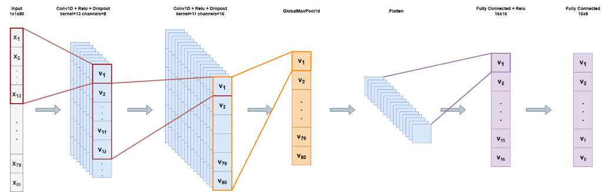
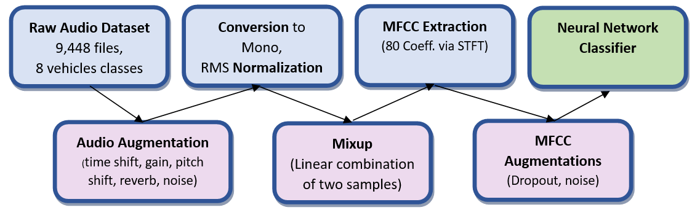

# Vehicle Audio Classification Using Deep Learning

**Course:** ECE 046211 – Technion – Deep Learning  
**Authors:**  
- Dan Epshtein (dan.epshtein@campus.technion.ac.il)  
- Shay Poran (shay.poran@campus.technion.ac.il)

---

## 📌 Abstract
The increasing presence of vehicles and drones in public and private spaces calls for reliable acoustic identification systems. Audio-based classification is often cheaper and less privacy-invasive than video surveillance. Our project investigates deep learning solutions for classifying different types of vehicles from audio recordings, including **drone detection**.

---

## 📚 Previous Work
Earlier methods relied on handcrafted features (ZCR, spectral centroid, MFCCs) with classical ML models (SVM, k-NN, QDA).  
Our baseline was based on [Janboubi Abderrahim’s Keras MFCC model](https://github.com/JANBOUBI-ABDERRAHIM/Vehicle-Sound-Classification-Notebook), which lacked:
- Multi-label handling
- Mixup augmentation
- Audio augmentation
- Flexibility for modern frameworks

We rebuilt the pipeline in PyTorch, added augmentations, and extended the task to drone detection.

---

# Model Architecture and Data Augmentations

The Base neural network, inspired by Jonboubi Abderrahim’s architecture, is a 1D convolutional network designed for sequence or time-series data. It begins with a 1D convolutional layer that transforms the single input channel into 8 channels using a kernel size of 13, followed by a ReLU activation, optional dropout (based on the specified dropout_rate), and max pooling to reduce dimensionality. A second convolutional block follows, increasing the depth to 16 channels with a kernel size of 11, again followed by ReLU, optional dropout, and another max pooling layer. The model then applies a custom GlobalMaxPool1d layer, which performs max pooling across the temporal dimension, effectively capturing the most salient feature across time, and flattens the output. This is followed by a fully connected layer that reduces the feature size to 16, applies another ReLU activation, and finally projects the output to the desired target size via another linear layer. 

•	Mixup creates synthetic training samples by linearly combining audio waveforms from two different classes: m·audio₁ + (1–m)·audio₂. The corresponding labels are combined proportionally, enabling both enhanced generalization and multi-label evaluation scenarios.\
•	Augmentations are divided into two categories:
1.	Audio-level augmentations (applied once when data is loaded): time shift, gain adjustment, pitch shift, reverb/impulse response, and Gaussian noise.
2.	MFCC-level augmentations (applied every epoch during training): Gaussian noise and dropout.

---
# Fine-Tuning Option

As drone presence identification can be a complex problem even when using visual sensing, and due to it's high importance is various applications, we decided to add the option to use a trained model as a base for fine tuning a binary classifier model. The fine tuning changes only the last layer's weights which is replaced with a linear layer with two outputs. See the way of use below. 

---

# Instructions

### 1) Set up a virtual environment

**Python 3.9+ recommended**\
python -m venv .venv\
source .venv/bin/activate   # Windows: .venv\Scripts\activate\
python -m pip install --upgrade pip\

### 2) Install dependencies

bash pip install -r requirements.txt

If you prefer conda:

bash\
conda create -n dlcourse python=3.10 -y\
conda activate dlcourse\
pip install -r requirements.txt\

### 3) Set up datasets

After installation, set up a data folder containing the audio files, sorted to classes in proper subfolders.
the path to the data folder will be described as data_dir. you can use --should_download_data to download the kaggle dataset.
additionally, create a folder where the grid search will save its best model and load it from during testing. the path to this folder will be described as best_model_dir.

## How to Run

CNN_classifier.py under model directory is where the model architecture is defined.
Under util director are:
1) **grid_search.py** which is the main project file where all parameters are configured.
2) **train.py** which contains the training and validation loop
3) **test.py**  which contains the test loop
4) **augmented_mfcc_dataset.py**- mainly a class designed to handle the data.
5) **data_import.py**- optional, helps downloading the original data from kaggle

When everything is set, you are ready to train your model. 
you can do so easily by calling the grid_search.py with the following parameters:\
    --best_model_dir, type=str, default=BEST_MODEL_DIR\
    --data_dir, type=str, default=DATA_DIR\
    --seed, type=int, default=0\
    --mixup, type=bool, default=False \
    --augment, type=bool, default=False\
    --is_multilabel, type=bool, default=False\
    --stratify, type=bool, default=True\
    --test_augment, type=bool, default=False\
    --should_download_data, type=bool, default=False\
    --search_attempts, type=int, default=10\
    --drone_fine_tune, type=bool, default=False\

---
## Example training run
python grid_search.py   --model_dir ../my_best_model --data_dir ../my_data --seed 0 --mixup true --augment false --is_multilabel true --stratify true --test_augment true --search_attempts 5

This will train a 5 models and save the best one according to the validation score.
it will do so using the data in data_dir, while mixing up pairs of audio files and train for a mulit-label case. it will not use audio augmentation but it will test the model on augment (noisy) test set

you could also test a model without training by using test.py directly.

---
# 🧠 References
Vehicle Sound Classification Notebook – Janboubi Abderrahim

Dalir et al., Classification of vehicles based on audio signals (2018)

Zhu et al., Mixup learning strategies for speaker verification (INTERSPEECH 2019)

Ablikim et al., Using CNNs to recognize bird species by song (Stanford CS230 Report)

Zaman et al., A survey of audio classification using deep learning (IEEE Access, 2023)

Open AIR Library – Impulse response data

---
# 📄 License
MIT License

